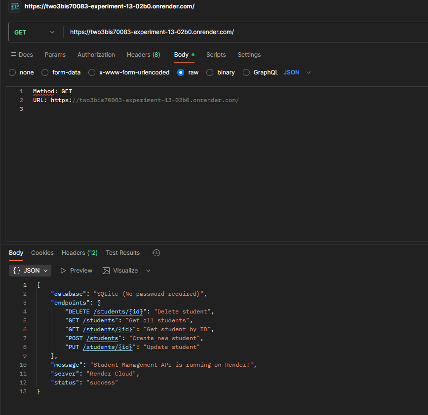
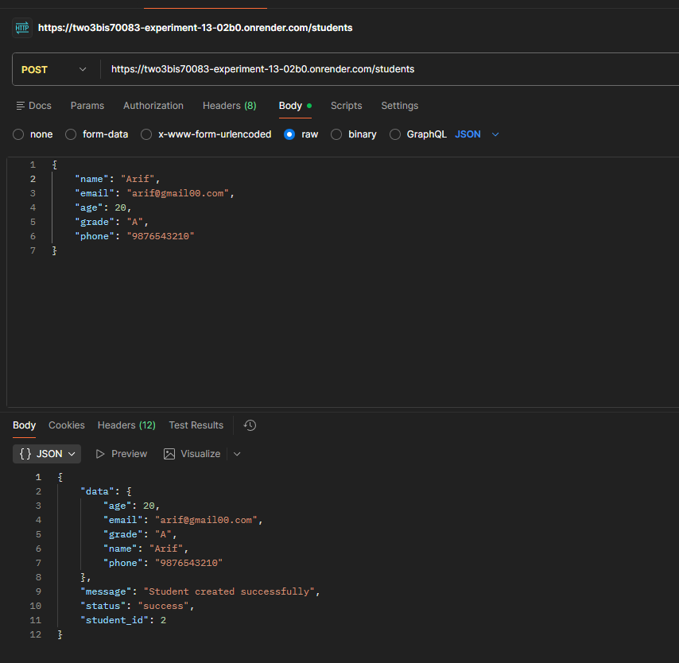
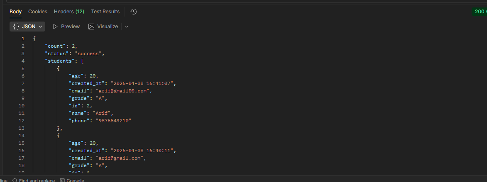
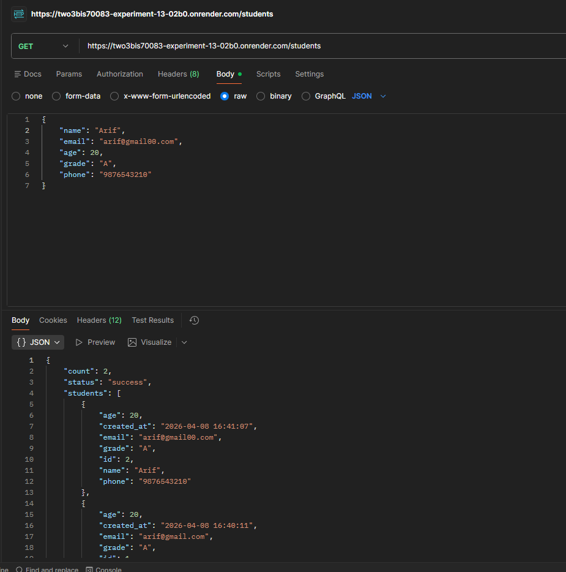
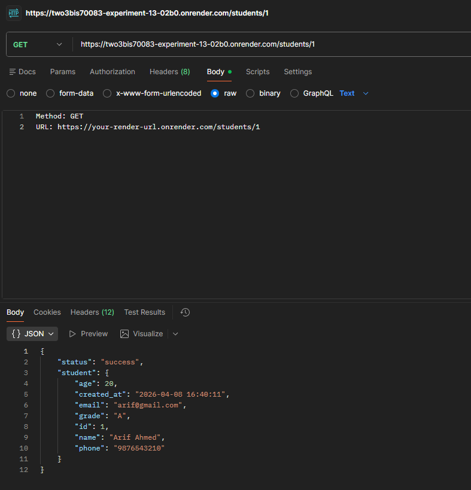
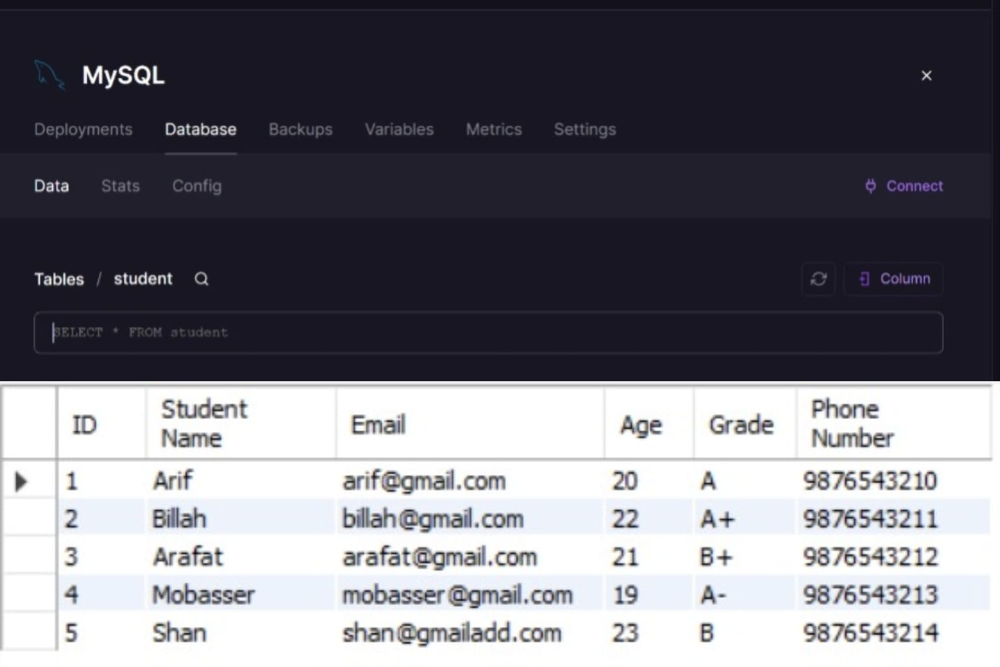

# EXPERIMENT 13  (Student CRUD API)

Flask + MySQL REST API for managing student records.

## Setup
1. Clone repo and install: `pip install -r requirements.txt`
2. Create `.env` from `.env.example` and fill in your DB credentials
3. Run MySQL setup SQL from `schema.sql`
4. Start server: `python app.py`

Render Link: https://two3bis70083-experiment-13-02b0.onrender.com/

## Screenshots

### 1. Server/DB Connection Running

### 2. Read User

### 3. Create User

### 4. Update User

### 5. Validation Procedure

### 6. 

### 7. Database Show

## Endpoints

| Method | Endpoint              | Description        |
|--------|-----------------------|--------------------|
| POST   | /api/students         | Create student     |
| GET    | /api/students         | Get all students   |
| GET    | /api/students/<id>    | Get one student    |
| PUT    | /api/students/<id>    | Update student     |
| DELETE | /api/students/<id>    | Delete student     |

## Validations
- Name: min 2 characters
- Email: valid format, must be unique
- Age: number between 1–120
- Course: min 2 characters

## Learning Outcomes

### 1. Understanding REST API Architecture
### 2. Flask Backend Development
### 3. Database Connectivity
### 4. CRUD Operations
### 5. Input Validation
### 6. Environment Variable Management
### 7. Cloud Database Integration
### 8. API Deployment on Cloud
### 9. API Testing with Postman
### 10. Error Handling