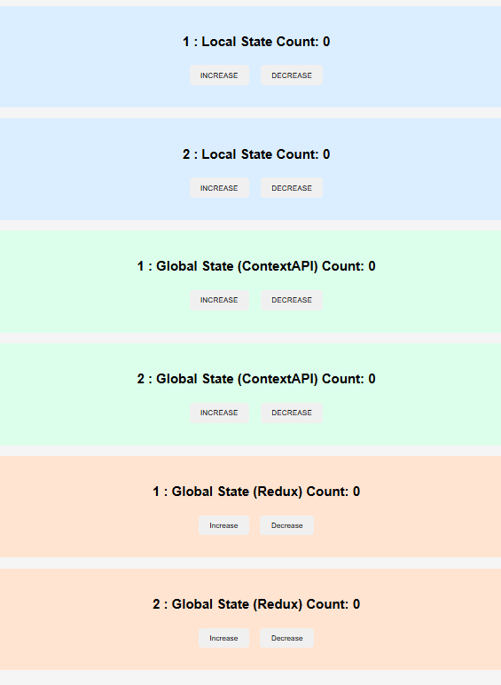

<h1>Learning outcomes </h1>

1. Understand the concept of state management in React applications.

2. Implement Local State using the useState hook and understand component-level state handling.

3. Use Context API to create and manage global state and share data between multiple components without prop drilling.

4. Create and configure a Redux store and manage application-level global state using reducers and actions.

5. Integrate React-Redux Provider to connect the Redux store with the React application.

6. Use useSelector and useDispatch hooks to read and update Redux state from components.

7. Compare and analyze the differences between Local State, Context API, and Redux.

8. Understand component reusability using props.

9. Learn the project folder structure for scalable React applications.

10. Develop a real working UI demonstrating three types of state management in one project.

## Output Screenshot

