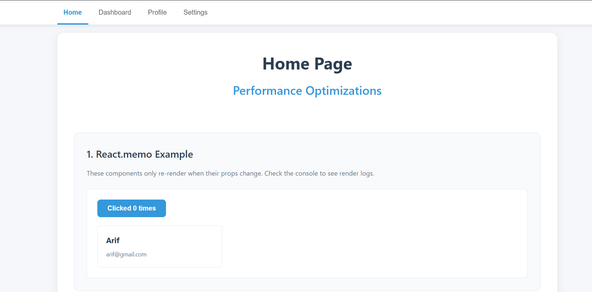
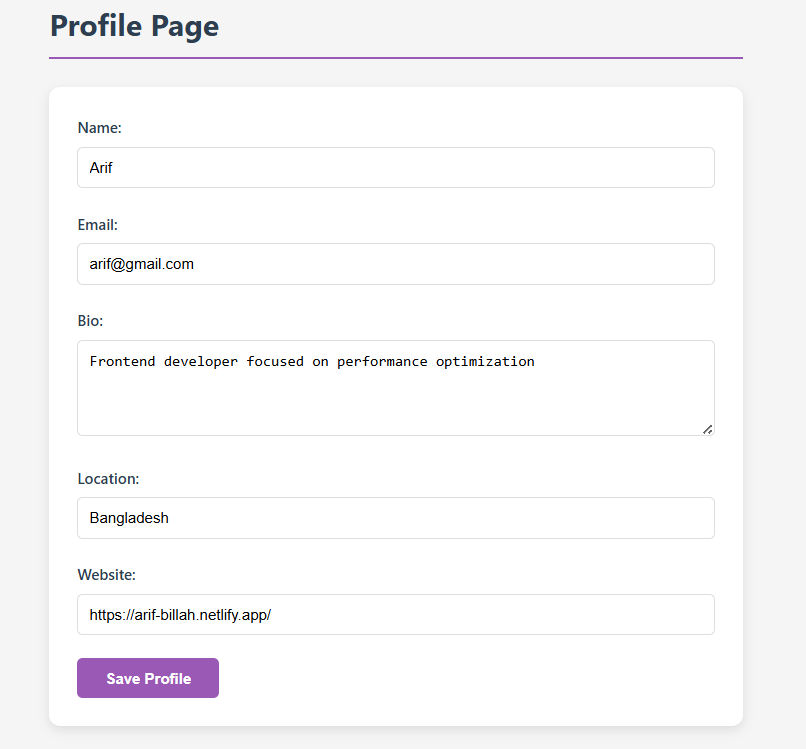

<h1>Learning Outcomes </h1>

1. Measure application performance using profiling tools
2. Implement React.memo for component memoization
3. Use useMemo and useCallback hooks effectively
4. Apply lazy loading and code splitting
5. Optimize rendering with virtualization
6. Reduce bundle size with tree shaking
7. Implement image optimization techniques
8. Analyze performance with Lighthouse

##  Live view Images 
 
 
 
 
 
 

