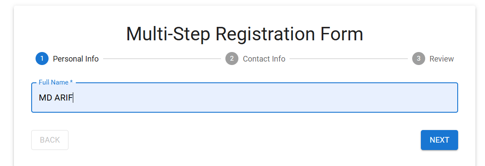
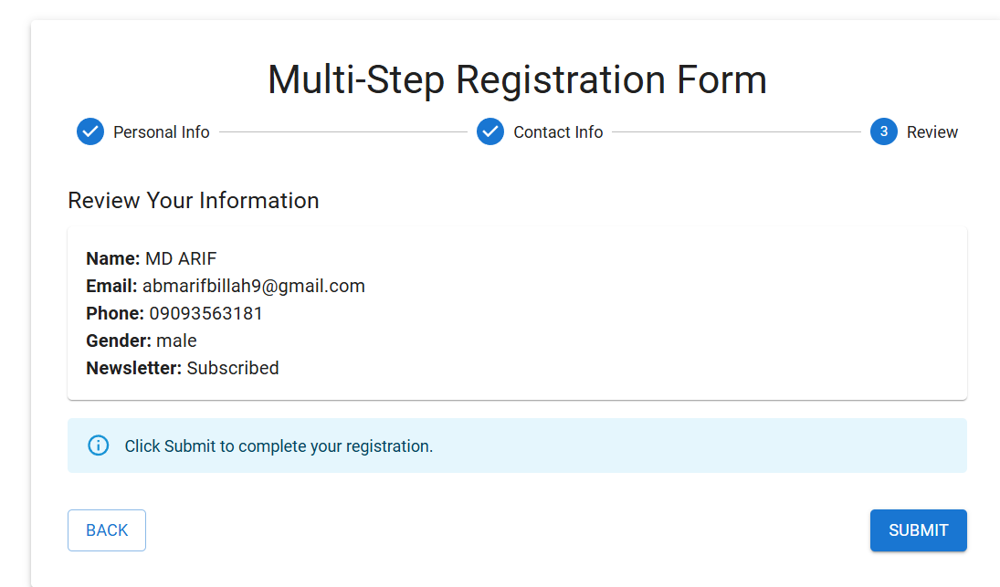
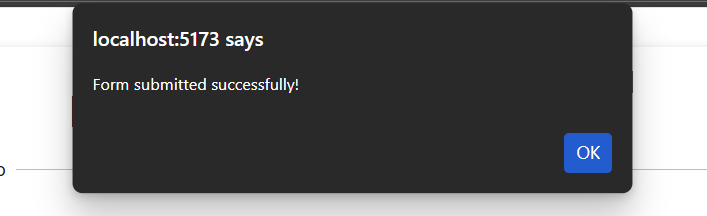

## Learning Outcomes 

1. Understand form handling in React
2. Create controlled components
3. Implement form validation
4. Use React Hook Form library
5. Integrate Yup validation
6. Handle file uploads
7. Build multi-step forms
8. Display error messages

## Live view images

