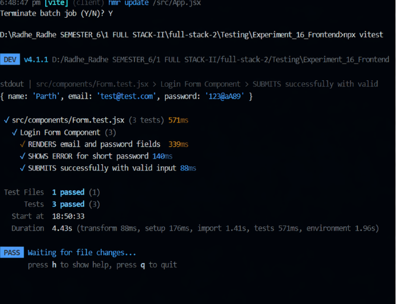
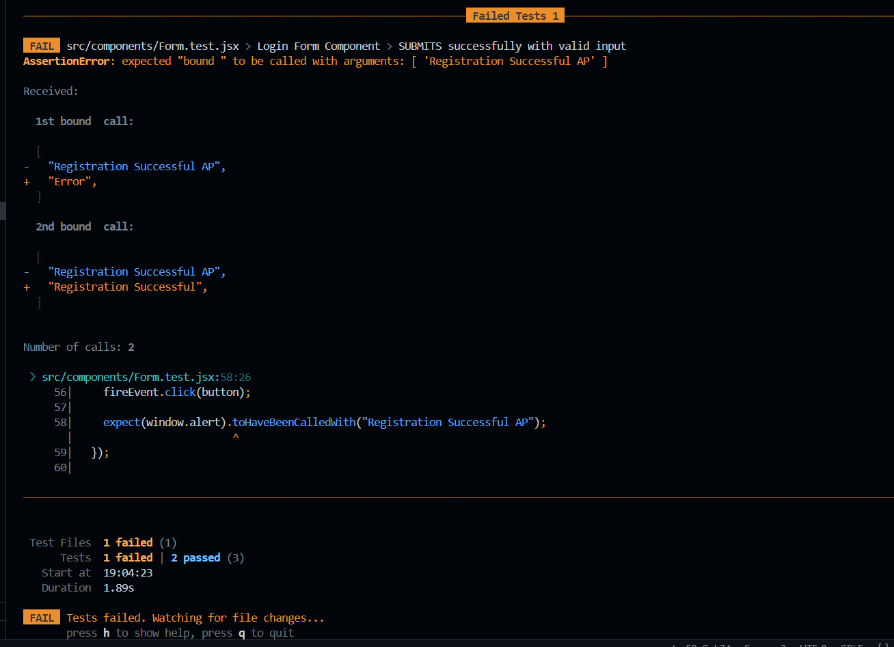
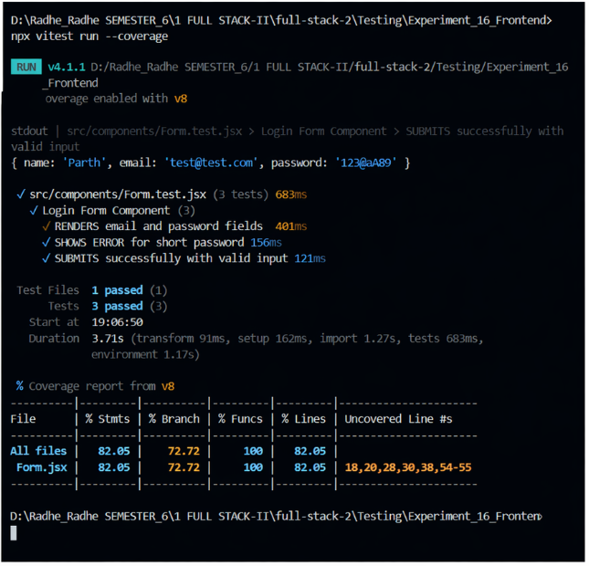
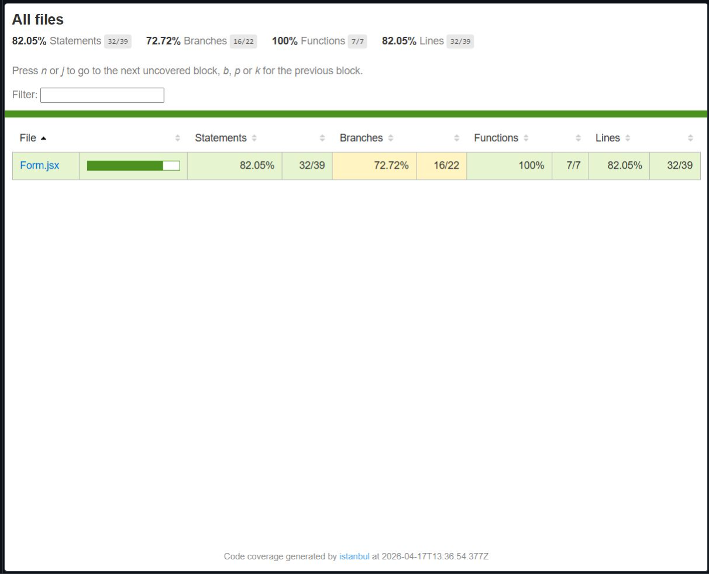
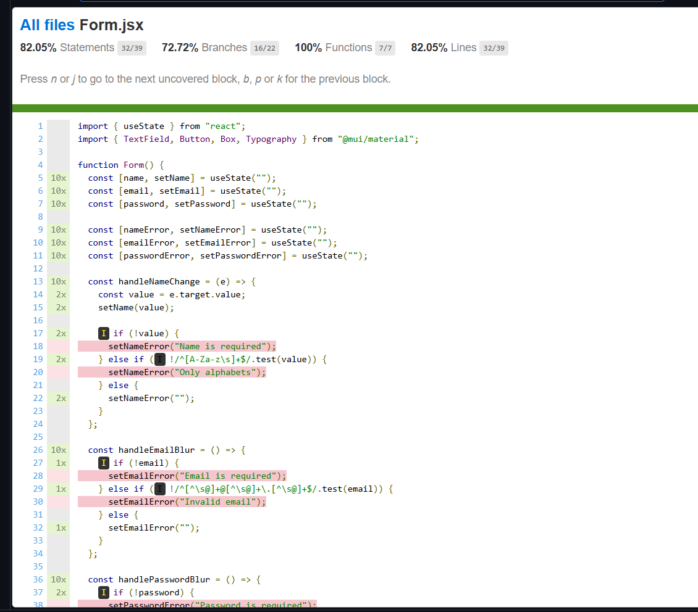

# Experiment 16: Frontend & Backend Testing

## AIM

To perform testing of both frontend and backend components of a web application using modern testing frameworks:
* Backend API testing using **pytest**
* Frontend form testing using **Vitest + React Testing Library**

## TOOLS & TECHNOLOGIES
* React.js (Vite)
* Vitest
* @testing-library/react
* @testing-library/jest-dom
* Material UI (MUI)


### Dev Tools
* VS Code
* Terminal / CLI

## PROJECT STRUCTURE

```
Experiment_16_Frontend/
│── src/
│   ├── components/
│   │   ├── Form.jsx
│   │   ├── Form.test.jsx
│   ├── setupTests.js
│   ├── App.jsx
│   ├── main.jsx
│
│── public/
│── Screenshots/
│── package.json
│── vite.config.js
│── README.md
```

## SETUP & INSTALLATION

### Install Dependencies

```bash
npm install
```

### 2️⃣ Install Testing Libraries

```bash
npm install -D vitest @testing-library/react @testing-library/jest-dom jsdom
```

## FRONTEND TESTING (VITEST)

### Setup File
`src/setupTests.js`
```js
import '@testing-library/jest-dom';
```

### Running Tests
```bash
npx vitest
```
or
```bash
npm run test
```


### Test Cases Implemented
* Form renders correctly
* Validation error for invalid password
* Successful form submission


## SCREENSHOTS

### All Tests Passed


### Failed Test Case


### Coverage Test Case

### Coverage Test Case (HTML)


### Coverage Test Case (HTML)


## LEARNING OUTCOMES

* Learned frontend testing using Vitest
* Understood component testing using React Testing Library
* Learned about debugging and validation handling skills