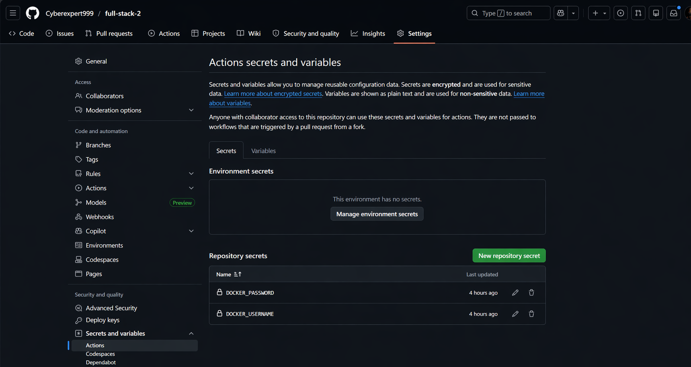
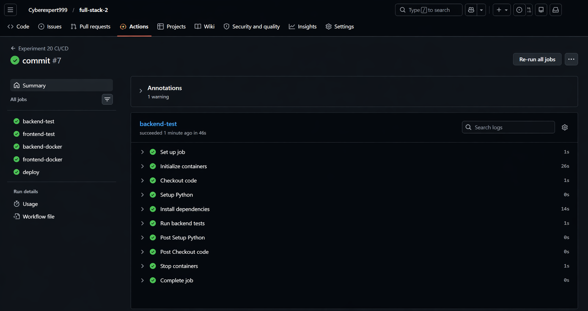
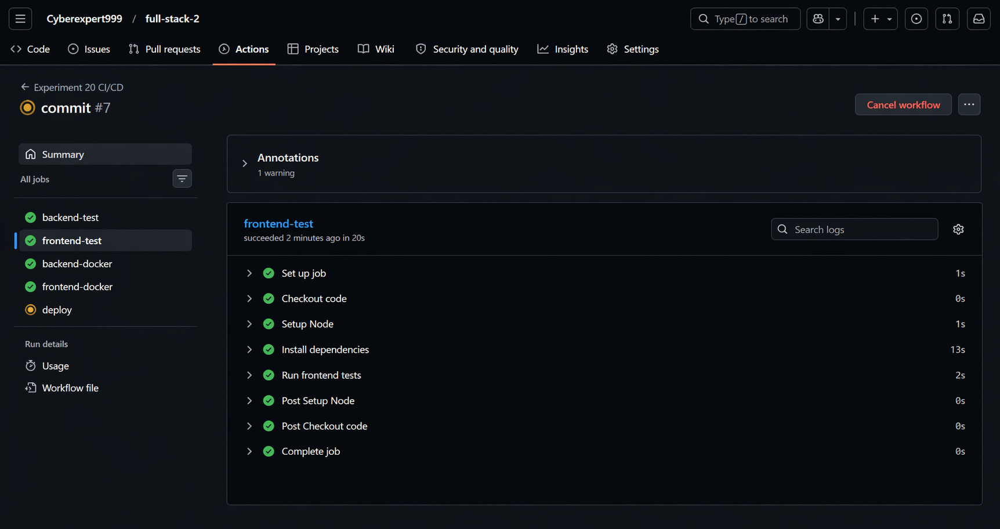
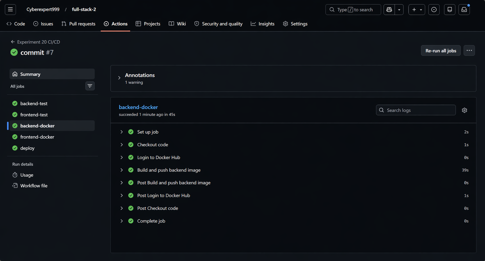
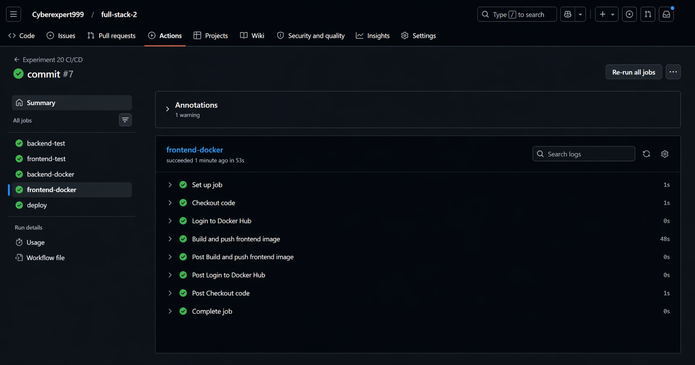
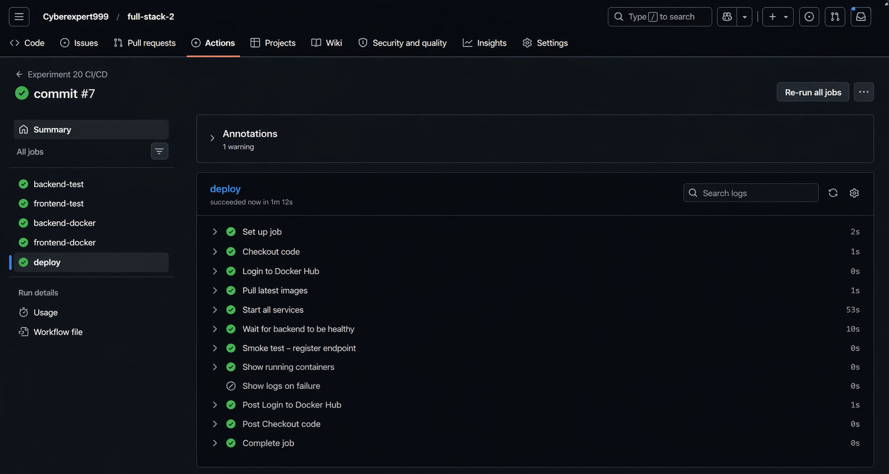
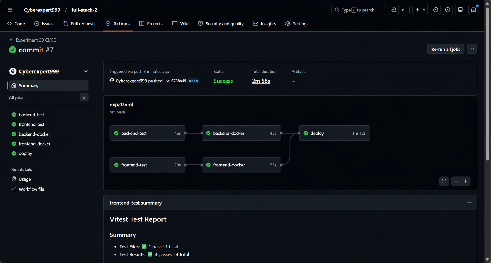
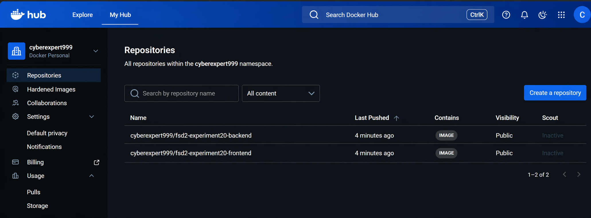

# Experiment 20 – CI/CD Pipeline with Docker Compose


## Aim

To implement a complete CI/CD pipeline for a full-stack application (React + Flask + MySQL) using GitHub Actions, Docker, and Docker Compose — automating testing, building Docker images, pushing to Docker Hub, and deploying the multi-container application.

---

## Tools Used

| Tool | Purpose |
|---|---|
| **Docker** | Containerize backend and frontend applications |
| **Docker Compose** | Orchestrate multiple containers (db, backend, frontend) |
| **GitHub Actions** | Automate CI/CD pipeline on every push |
| **Docker Hub** | Store and distribute Docker images |
| **Flask (Python)** | Backend REST API |
| **React + Vite** | Frontend single-page application |
| **MySQL 8** | Relational database |
| **pytest** | Backend unit testing |
| **Vitest** | Frontend unit testing |

---

## Project Structure

```
Experiment_20/
├── backend/
│   ├── app.py              # Flask API (register, login)
│   ├── test_app.py         # pytest tests
│   ├── requirements.txt    # Python dependencies
│   └── Dockerfile          # Backend container definition
├── frontend/
│   ├── src/
│   │   ├── App.jsx         # React auth UI
│   │   ├── App.test.jsx    # Vitest tests
│   │   └── setupTests.js   # Testing setup
│   └── Dockerfile          # Frontend container definition
├── database/
│   └── init.sql            # MySQL schema initialization
├── docker-compose.yml      # Multi-container orchestration
└── .github/workflows/
    └── exp20.yml           # CI/CD pipeline definition
```

---

## Commands Reference

### Docker – Image Commands
| Command | Description |
|---|---|
| `docker build -t <name> <path>` | Build a Docker image from a Dockerfile |
| `docker images` | List all locally available images |
| `docker rmi <name>` | Remove a Docker image |
| `docker pull <image>` | Pull an image from Docker Hub |
| `docker push <name>` | Push a local image to Docker Hub |

### Docker – Container Commands
| Command | Description |
|---|---|
| `docker run -d --name <name> <image>` | Run a container in detached mode |
| `docker run -p <host>:<container>` | Map host port to container port |
| `docker run -e KEY=VALUE` | Set environment variable in container |
| `docker run --network <name>` | Connect container to a network |
| `docker ps` | List running containers |
| `docker ps -a` | List all containers including stopped |
| `docker logs <name>` | View container logs |
| `docker rm -f <name>` | Force remove a container |

### Docker – Network Commands
| Command | Description |
|---|---|
| `docker network create <name>` | Create a custom bridge network |
| `docker network rm <name>` | Remove a network |

### Docker – Login Commands
| Command | Description |
|---|---|
| `docker login` | Log in to Docker Hub |
| `docker logout` | Log out of Docker Hub |

### Docker Compose Commands
| Command | Description |
|---|---|
| `docker compose up` | Start all services defined in docker-compose.yml |
| `docker compose up --build` | Build images then start all services |
| `docker compose up -d` | Start all services in detached (background) mode |
| `docker compose down` | Stop and remove all containers |
| `docker compose down -v` | Stop containers and delete volumes (database data) |
| `docker compose pull` | Pull latest images from registry |
| `docker compose logs` | Show logs from all services |
| `docker compose ps` | List containers managed by Compose |

### Git Commands
| Command | Description |
|---|---|
| `git add .` | Stage all changes |
| `git commit -m "message"` | Commit staged changes |
| `git push` | Push to GitHub (triggers the CI/CD pipeline) |

---

## Procedure

### Step 1 – Write Dockerfiles

**Backend Dockerfile** (`backend/Dockerfile`):
- Uses `python:3.10` base image
- Copies source code and installs dependencies from `requirements.txt`
- Runs `python app.py` on start

**Frontend Dockerfile** (`frontend/Dockerfile`):
- Uses `node:20` base image
- Installs npm dependencies, builds the Vite app
- Serves the production build via `npm run preview`

---

### Step 2 – Write docker-compose.yml

The `docker-compose.yml` defines 3 services connected on an internal Docker network:

```yaml
services:
  db:       # MySQL 8 database
  backend:  # Flask API — depends on db
  frontend: # React app — depends on backend
```

- `db` uses an init SQL script to create the `user` table on first start
- `backend` receives DB connection details via environment variables (`DB_HOST=db`)
- All services communicate using Docker's internal DNS (container names as hostnames)

---

### Step 3 – Build Docker Images Manually

```bash
docker build -t exp20_backend ./backend
docker build -t exp20_frontend ./frontend
docker images
```


---

### Step 4 – Run Containers Manually (without Compose)

Create a Docker network so containers can communicate, then start each container individually:

```bash
docker network create fsd2-network

docker run -d --name mysql_db --network fsd2-network \
  -e MYSQL_ROOT_PASSWORD=root -e MYSQL_DATABASE=authdb \
  -e MYSQL_USER=user -e MYSQL_PASSWORD=password \
  -p 3307:3306 mysql:8

docker run -d --name flask_backend --network fsd2-network \
  -e DB_HOST=mysql_db -e DB_USER=user \
  -e DB_PASSWORD=password -e DB_NAME=authdb \
  -p 5000:5000 exp20_backend:latest

docker run -d --name react_frontend --network fsd2-network \
  -p 5173:5173 exp20-frontend:latest

docker ps
```

---

### Step 5 – Run with Docker Compose

Stop the manual containers and use Compose to start everything with one command:

```bash
docker rm -f mysql_db flask_backend react_frontend
docker network rm fsd2-network
docker compose up --build
```

Compose automatically:
1. Builds both images from their Dockerfiles
2. Pulls `mysql:8`
3. Creates an internal network
4. Starts all 3 containers in dependency order (`db` → `backend` → `frontend`)


---

### Step 6 – Configure CI/CD Secrets

**Create a Docker Hub access token** for secure authentication from GitHub Actions:




---

### Step 7 – GitHub Actions Pipeline

The pipeline (`exp20.yml`) has 3 stages triggered automatically on every `git push` to `main`:

#### Stage 1 – CI (Testing)
- `backend-test` — Spins up a real MySQL service container, installs Python deps, runs `pytest`
- `frontend-test` — Installs Node deps, runs `vitest`

#### Stage 2 – CD (Build & Push)
- `backend-docker` — Builds backend image and pushes to Docker Hub (only if tests pass)
- `frontend-docker` — Builds frontend image and pushes to Docker Hub (only if tests pass)

#### Stage 3 – Deploy
- Pulls latest images from Docker Hub
- Runs `docker compose up -d` to start all 3 services
- Waits for backend health check on port 5000
- Runs a smoke test on the `/register` endpoint to confirm the full stack works

**backend-test job passed:**



**frontend-test job passed:**



**backend-docker job passed (image pushed to Docker Hub):**


**frontend-docker job passed (image pushed to Docker Hub):**



**deploy job passed (smoke test successful):**



**Full pipeline summary — all 5 jobs green:**



**Docker Hub — both images pushed successfully:**


---

## Pipeline Flow

**Stage 1 — CI (runs in parallel)**

| Job | What it does |
|---|---|
| `backend-test` | Runs pytest against a real MySQL service container |
| `frontend-test` | Runs Vitest component tests |

**Stage 2 — CD (runs only if tests pass)**

| Job | Depends On | What it does |
|---|---|---|
| `backend-docker` | `backend-test` | Builds backend image and pushes to Docker Hub |
| `frontend-docker` | `frontend-test` | Builds frontend image and pushes to Docker Hub |

**Stage 3 — Deploy (runs only after both images are pushed)**

| Job | Depends On | What it does |
|---|---|---|
| `deploy` | `backend-docker` + `frontend-docker` | Pulls images, runs `docker compose up -d`, smoke tests `/register` endpoint |

> If any test fails → Docker push is skipped → broken code never reaches Docker Hub.

---

## Learning Outcomes

- Learned how to containerize a full-stack application using Docker and connect multiple containers through Docker Compose.
- Understood the CI/CD pipeline stages — automated testing, building Docker images, pushing to Docker Hub, and deploying via Compose.
- Gained hands-on experience configuring GitHub Actions workflows including MySQL service containers for integration testing.
- Learned to manage sensitive credentials securely using GitHub repository secrets.
- Understood how Docker Compose simplifies multi-container orchestration compared to running containers manually.